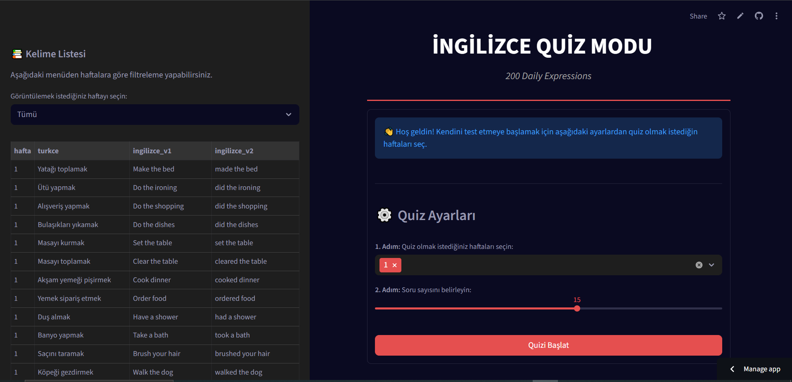
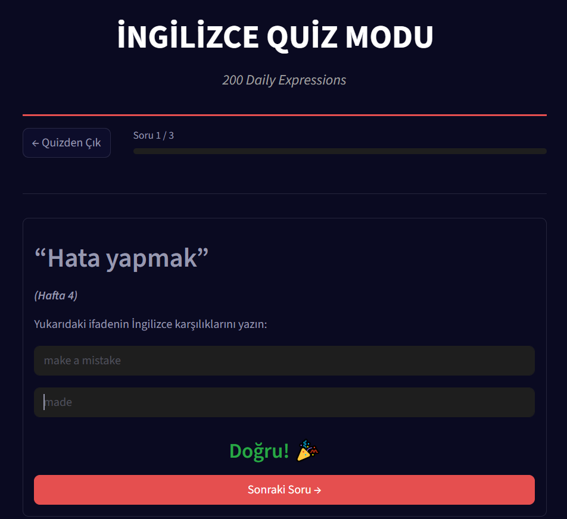
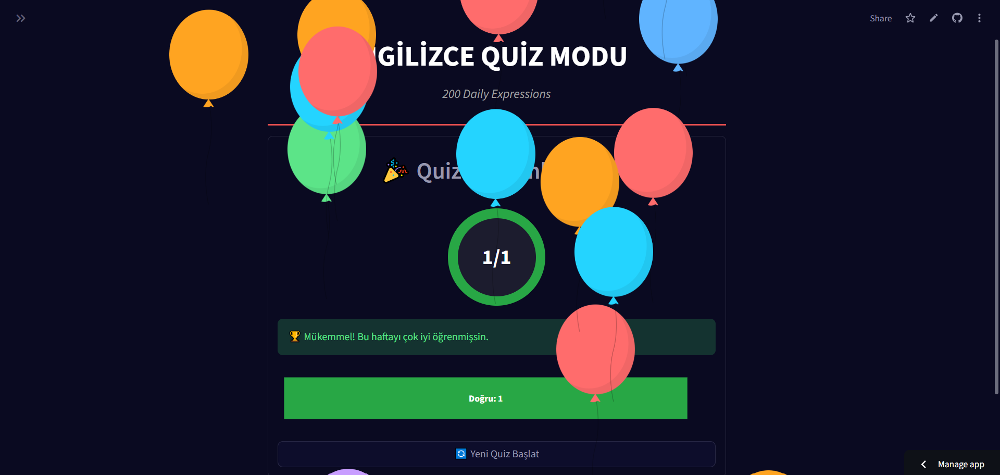
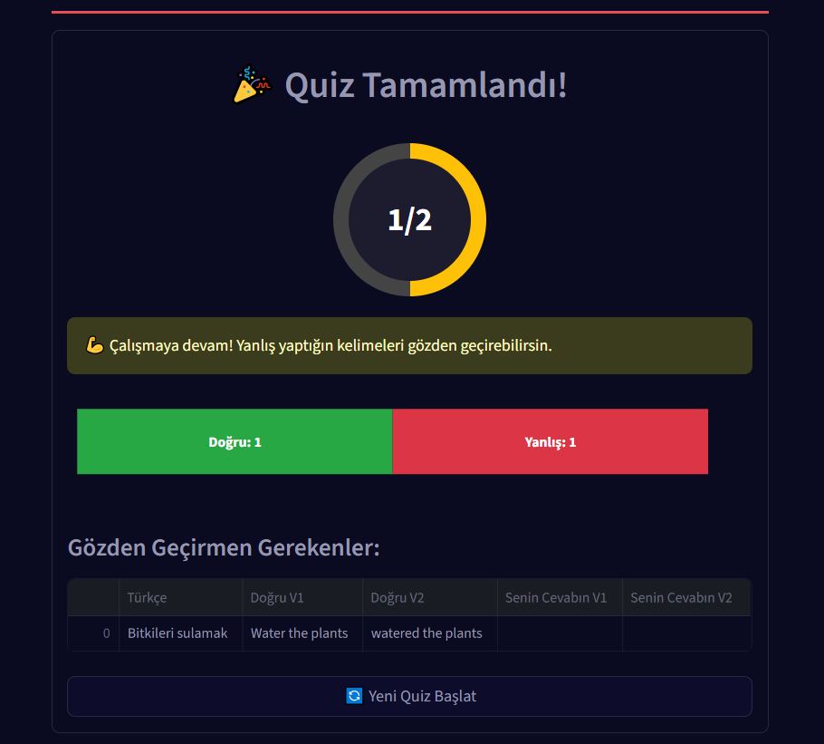

# İngilizce Quiz Uygulaması: A2 Seviyesi Günlük İfadeler



A2 seviye İngilizce kursumda, her hafta öğrendiğimiz günlük ifadeler ve fiillerin ikinci halleri (V2) üzerine yapılan quizlere daha etkili çalışabilmek için bu interaktif uygulamayı geliştirdim. Amacım, sıkıcı ezber listeleri yerine, test ederek ve anında geri bildirim vererek öğrenmeyi pekiştiren bir araç yaratmaktı. Bu proje, hem kendi öğrenme sürecimi kolaylaştırmak hem de benimle aynı yolda yürüyen kurstaki diğer arkadaşlarıma ve A2 seviyesindeki tüm dil öğrencilerine faydalı bir kaynak sunmak için hayata geçti.

## 🚀 Canlı Demo

Uygulamayı hemen denemek için buraya tıklayın: [**https://daily-expression-trainer.streamlit.app/**]

---

## ✨ Özellikler

Bu platform, öğrenme sürecini daha verimli ve keyifli hale getirmek için tasarlandı:

- **📚 Dinamik Kelime Listesi:** Yan menüde bulunan kelime listesi, haftalara göre filtrelenebilir. Böylece "Bu hafta hangi kelimeleri öğrenmiştik?" diye düşünmeden, doğrudan ilgili konuya odaklanabilirsiniz.

- **⚙️ Kişiye Özel Quizler:** Hangi haftalardan sınava gireceğinizi ve toplam soru sayısını kendiniz belirleyebilirsiniz. Soru sayısı, seçtiğiniz haftalardaki mevcut kelime sayısına göre dinamik olarak ayarlanır.

- **🧠 Akıllı ve Esnek Cevap Kontrolü:** Yazım hataları motivasyonunuzu kırmasın! Cevaplar, büyük/küçük harf, baştaki/sondaki boşluklar ve hatta kelime içindeki boşluklara (`"get up"` ve `"getup"` gibi) karşı duyarsızdır.

- **🏃‍♂️ Akıcı Quiz Deneyimi:**

  - **İnteraktif Geri Bildirim:** Doğru cevaplarda "pulse" (vurgu), yanlış cevaplarda ise "shake" (sallanma) animasyonu ile anında geri bildirim alırsınız.
  - **Dinamik Butonlar:** Son soruya geldiğinizde "Sonraki Soru" butonu, "Quizi Bitir" olarak değişerek size yol gösterir.

  

- **📊 Görsel Başarı Raporu:**

  - Quiz sonunda, skorunuz sadece bir sayı olarak değil, başarı oranınıza göre rengi değişen **dairesel bir ilerleme çubuğu** ile gösterilir.
  - Doğru ve yanlış cevap sayılarınız, şık bir çubuk grafikle görselleştirilir.
  - Başarı oranınıza göre motive edici mesajlar ve %90 üzeri başarıda **balon animasyonu** ile başarınız kutlanır!

  

- **📝 Hata Analizi:** Öğrenmenin en önemli parçası hatalarımızdan ders çıkarmaktır. Quiz sonunda yanlış yaptığınız kelimeler, doğrularıyla birlikte bir tabloda listelenir.

  

---

## 🛠️ Kullanılan Teknolojiler

Bu projenin geliştirilmesinde aşağıdaki kütüphaneler ve teknolojiler kullanılmıştır:

- **[Streamlit](https://streamlit.io/):** Web uygulamasının ana çatısı.
- **[Pandas](https://pandas.pydata.org/):** Kelime verilerini (`kelimeler.csv`) okumak ve yönetmek için.
- **[Plotly](https://plotly.com/python/):** Quiz sonundaki interaktif başarı grafiğini oluşturmak için.
- **HTML & CSS:** Arayüzü özelleştirmek ve animasyonlar eklemek için.

---

## 🚀 Kurulum ve Çalıştırma

Projeyi kendi bilgisayarınızda çalıştırmak isterseniz, aşağıdaki adımları izleyebilirsiniz.

### Gereksinimler

- Python 3.8+
- pip

### Adımlar

1.  **Projeyi Klonlayın:**

    ```bash
    git clone https://github.com/KULLANICI_ADINIZ/PROJE_ADINIZ.git
    cd PROJE_ADINIZ
    ```

2.  **Sanal Ortamı Oluşturun ve Aktifleştirin:**

    ```bash
    # Sanal ortamı oluştur
    python -m venv .venv

    # Sanal ortamı aktifleştir (Windows)
    .\.venv\Scripts\activate

    # Sanal ortamı aktifleştir (macOS/Linux)
    source .venv/bin/activate
    ```

3.  **Gerekli Kütüphaneleri Yükleyin:**
    Proje ana dizininde bulunan `requirements.txt` dosyası, gerekli tüm kütüphaneleri içerir.

    ```bash
    pip install -r requirements.txt
    ```

4.  **Uygulamayı Çalıştırın:**
    ```bash
    streamlit run app.py
    ```

Tarayıcınızda otomatik olarak açılan pencereden uygulamayı kullanmaya başlayabilirsiniz.
